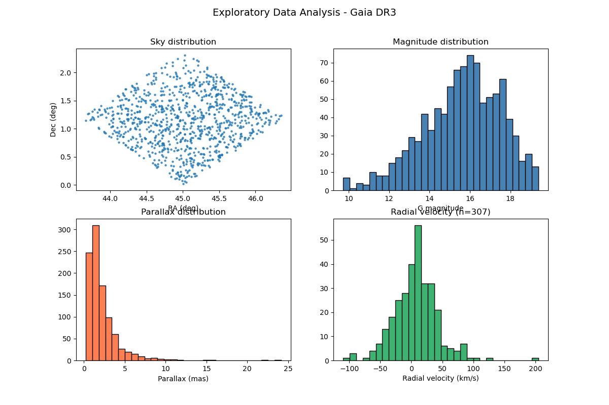

# Stellar Data Analysis with Gaia DR3

## Overview

This project demonstrates a complete data science pipeline applied to 
real astronomical data from the **Gaia DR3 survey** — from data download 
and cleaning to exploratory analysis and scientific visualization.

All data were downloaded directly from the Gaia Archive using 
`astroquery`, processed and analyzed in Python.

---

## What I Did

### 1. Data Download
- Downloaded 1000 stars from Gaia DR3 using `astroquery.gaia`
- Selected key columns: position (ra, dec), parallax, proper motions, 
  radial velocity, and photometry (G, BP, RP bands)
- Applied quality filters directly in the query (`parallax_over_error > 10`)

### 2. Data Cleaning
- Removed duplicate entries
- Filtered unphysical parallax values (parallax > 0)
- Removed magnitude outliers using 1-99% percentile filter
- Documented NaN values in radial_velocity as an instrumental 
  limitation of Gaia DR3, not an error

### 3. Exploratory Data Analysis (EDA)
- Sky distribution of the sample
- Magnitude distribution (G band)
- Parallax distribution
- Radial velocity distribution

### 4. Derived Variables
- **Distance** (pc and kpc): $d \text{ (pc)} = 1000 / \pi \text{ (mas)}$
- **Distance modulus**: $\mu = 5 \log_{10}(d) - 5$
- **Galactic coordinates** (l, b) from Astropy
- **Transverse velocity**: $v_t = 4.74 \cdot \mu_{total} \cdot d \text{ (kpc)}$

### 5. Color-Magnitude Diagram (HR Diagram)
- Computed BP-RP color index as a proxy for stellar temperature
- Computed absolute magnitude M_G using the distance modulus
- Plotted the Color-Magnitude Diagram revealing the **main sequence**

---

## Results

### Exploratory Data Analysis

*Four-panel EDA: sky distribution, magnitude histogram, parallax 
distribution, and radial velocity distribution.*

### Color-Magnitude Diagram (Gaia DR3)

*Color-Magnitude Diagram showing the main sequence clearly. Points 
in the lower left (BP-RP < 0.5, M_G > 10) could be white dwarf 
candidates or parallax outliers — future work could investigate this 
by including parallax_error in the query.*

---

## Technical Stack

| Tool | Purpose |
|---|---|
| `Python 3.12` | Core language |
| `astroquery` | Gaia DR3 data download |
| `Pandas` | Data manipulation and cleaning |
| `NumPy` | Numerical computation |
| `Astropy` | Coordinate transformations, units |
| `Matplotlib` | Visualizations |

---

## Data

- **Source**: Gaia DR3 survey — publicly available at the 
  [Gaia Archive](https://gea.esac.esa.int/archive/)
- **Downloaded independently** using `astroquery.gaia`
- **Sample**: 1000 stars with quality filter `parallax_over_error > 10`
- Data cleaning performed from scratch as part of this project

---

## References

- Gaia Collaboration (2022). *Gaia Data Release 3*. 
  [doi:10.1051/0004-6361/202243940](https://doi.org/10.1051/0004-6361/202243940)

---

## Author

**Margionet Fabiola Díaz** — BSc in Physics, Universidad de Los Andes, 
Mérida, Venezuela  
[GitHub](https://github.com/margiofabiolad)

*This project was developed as part of my transition into data science, 
applying scientific computing skills to real astronomical datasets.*
